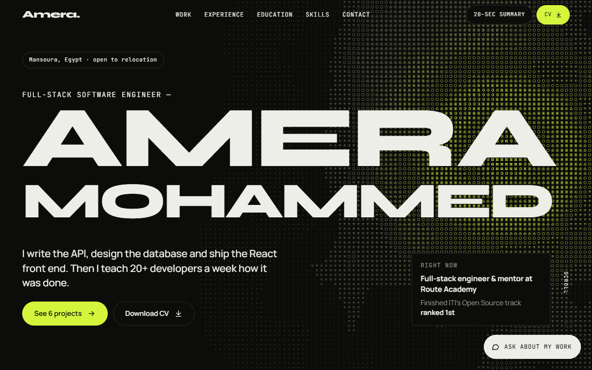
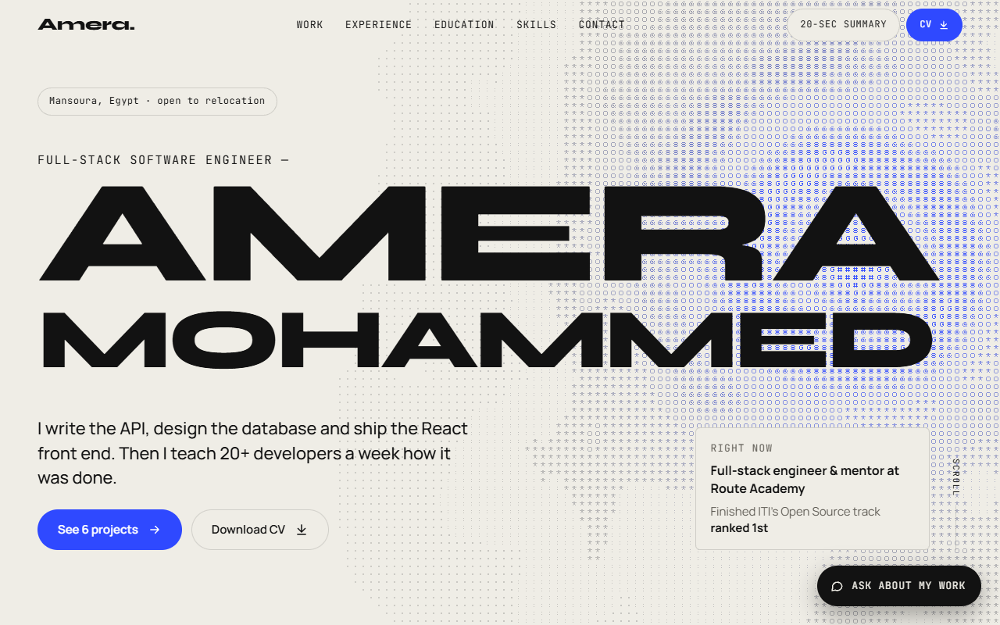
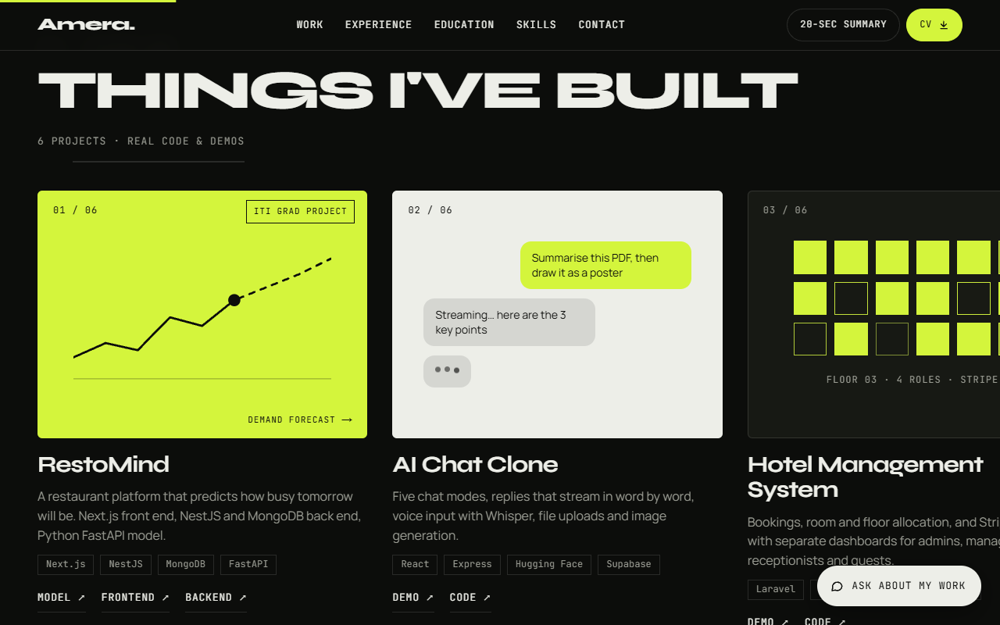
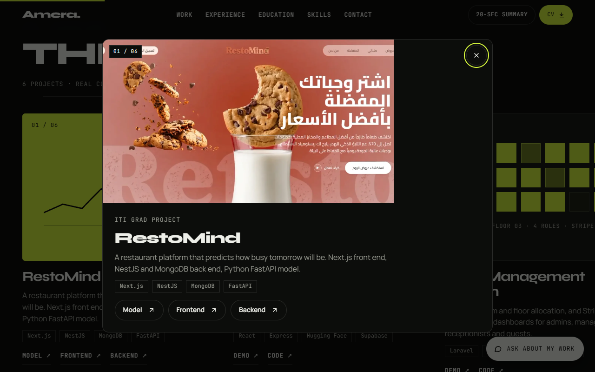
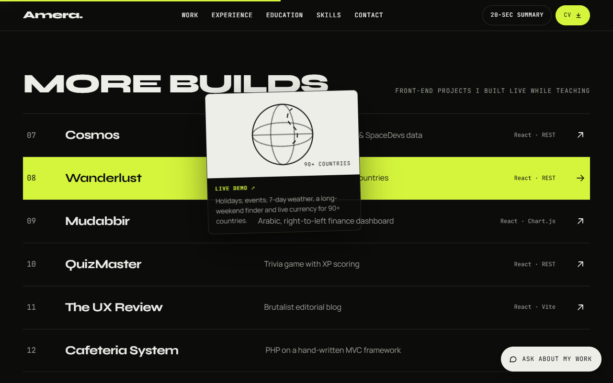
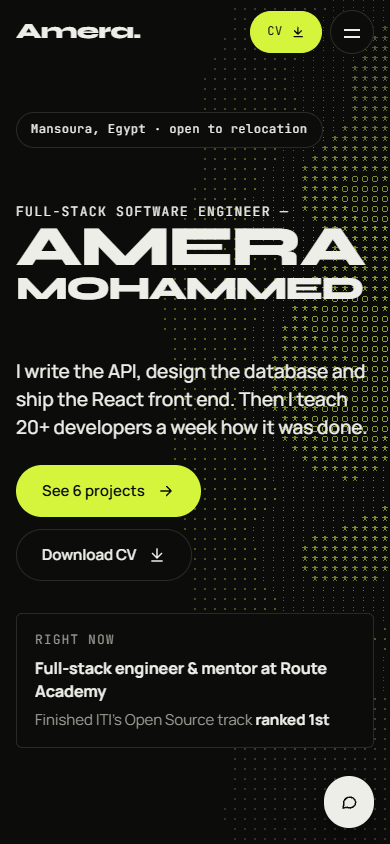

# Amera Mohammed — Portfolio (Next.js)

The static portfolio rebuilt on **Next.js 16 (App Router)** with React 19 and
plain CSS (no Tailwind). Same design, same four palettes, same WebGL hero,
same scroll-driven animations — now componentised and data-driven.



## Screenshots

| Home — light "bone" palette | Featured work (per-project art) |
|---|---|
|  |  |

| Project detail modal | More builds — hover preview |
|---|---|
|  |  |

<p align="center">
  
</p>

## Quick start

```bash
npm install
npm run dev            # http://localhost:3000
```

```bash
npm run build          # production build
npm start              # serve the build
npm run lint           # ESLint
npm run format         # Prettier
```

## Tests

Playwright + a Chromium build (Edge/Chrome work too).

```bash
npm i -D playwright
npx playwright install chromium        # or set CHROMIUM_PATH to Edge/Chrome
npm run build
npm test                               # 207 checks across 5 widths + contrast
npm run test:shots                     # per-section screenshots
# against an already-running server:
# BASE_URL=http://127.0.0.1:3000 npm test
```

The suite starts its own `next start` on port 3123 (see `tests/_server.cjs`),
writes `tests/out/REPORT.md` and `tests/out/results.json`, and exits non-zero
on any failure (safe to gate CI).

## Structure

```
app/
  layout.js            fonts, metadata, theme-init script, providers
  page.js              composes the sections
  globals.css          design tokens + base (from the static site)
  styles/              components.css · sections.css · responsive.css
                       nextjs-additions.css · projects.css
components/            nav · hero · work · summary · chat · theme · ui · interactions
content/               profile · projects · themes · stats · experience
                       education · skills · principles · chat-kb
data/portfolio.json    canonical source data (reference)
docs/                  component-map.md · roadmap.md · screenshots/
public/images/         project screenshots (png + webp)
```

The static original is kept under `assets/` for reference and **excluded from
git**. See `docs/component-map.md` for the file-by-file mapping and a plan to
split the global CSS into CSS Modules later.

## Editing content

Everything a recruiter reads comes from `content/*.js`:

| Want to change | Edit |
|---|---|
| Name, email, phone, links, location, CV | `content/profile.js` |
| Featured projects / more builds (+ images) | `content/projects.js` |
| Per-project card art | `components/work/ProjectArt.js` |
| Experience bullets (`**bold**`) | `content/experience.js` |
| Education, honours, languages | `content/education.js` |
| Skills groups | `content/skills.js` |
| Stats + stack band | `content/stats.js` |
| About words, principles, nav | `content/principles.js` |
| Chat answers | `content/chat-kb.js` |
| Palettes | `content/themes.js` + the `html[data-theme]` blocks in `app/globals.css` |

Project screenshots live in `public/images/` and are referenced as
`/images/<name>.webp` in `content/projects.js`. Clicking a project card or row
opens a themed detail modal with the full-size screenshot and links.

Screenshots in this README were captured with `tests/screenshots.cjs`-style
Playwright runs and saved under `docs/screenshots/`.
